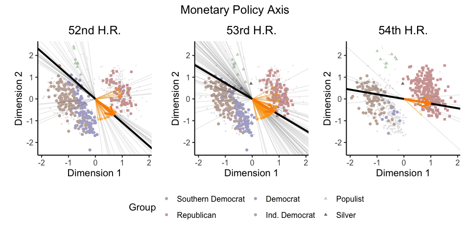

<!-- README.md is generated from README.Rmd. Please edit that file -->

# issueirt: Measuring Issue Specific Ideal Points

<!-- badges: start -->

[](https://github.com/sooahnshin/issueirt/actions/workflows/R-CMD-check.yaml)
<!-- badges: end -->

Author:

- [Sooahn Shin](http://sooahnshin.com/)

Reference:

- Shin, Sooahn (2024). “Measuring Issue Specific Ideal Points from Roll
  Call Votes.” Working Paper.
  - *Please reach out to the author for the latest version of the
    paper.*
  - *Please cite the paper when using the package.*

## Installation

You can install the development version of `issueirt` from
[GitHub](https://github.com/) with:

``` r
# install.packages("devtools")
devtools::install_github("sooahnshin/issueirt", build_vignettes = TRUE)
vignette("using_issueirt")
vignette("dynamic_issueirt")
```

## Example: U.S. House of Representatives (1891 - 1896)

Check `vignette("dynamic_issueirt")` for more details.

### Visualization of Issue Specific Axis

``` r
library(issueirt)
p_ls <- plot_issueaxis(stan_input        = issueirt:::dynamic_stan_input, 
                       posterior_summary = issueirt:::posterior_summary_pp,
                       group             = issueirt:::posterior_df_pp$group, 
                       p.title           = "IssueIRT",
                       breaks.group      = c("Southern Democrat", "Republican", "Democrat", 
                                             "Ind. Democrat", "Populist", "Silver"), 
                       values.shape      = c(19, 15, 19, 19, 17, 17), 
                       values.color      = c("#C4B0A6", "#D1A4A2", "#B0AECF", 
                                             "#B8B5CF", "#C2D7C1", "#777777"))

library(patchwork)
library(ggplot2)
theme_set(theme_classic(base_size = 15) + 
          theme(legend.position = "bottom", plot.title = element_text(hjust = 0.5)))

## Monetary Policy Axis: 52nd to 54th H.R. (1891 - 1896)
(p_ls[["H52_Monetary"]]   + labs(title = "52nd H.R.")) +
  (p_ls[["H53_Monetary"]] + labs(title = "53rd H.R.")) +
  (p_ls[["H54_Monetary"]] + labs(title = "54th H.R.")) +
  plot_layout(ncol = 3, guides = "collect") &
  plot_annotation(title = "Monetary Policy Axis")
```



- Points: multidimensional ideal points
- Grey lines: monetary policy related roll-call axes
- **Black** line: monetary policy axis

`IssueIRT` is a hierarchical Item Response Theory (IRT) model that
estimates an **issue-specific axis** representing a continuum extending
from left to right positions on the issue using (1) roll-call votes and
(2) user-supplied issue labels. We can project legislators’ ideal points
on the issue-specific axis to generate single-dimensional,
**issue-specific ideal points** as visualized below.

### Visualization of Issue Specific Ideal Points

``` r
issue_irt <- get_ideal_points(stan_fit    = issueirt:::fit_dynamic_updated, 
                              issue_label = issueirt:::dynamic_stan_input$misc$issue_code_df$codebook$label,
                              legis_label = issueirt:::dynamic_stan_input$misc$legis_term, 
                              legis_group = issueirt:::posterior_df_pp$group)
monetary_irt <- issue_irt |> 
                dplyr::filter(issue_label %in% c("H52_Monetary", "H53_Monetary", "H54_Monetary")) |>
                dplyr::mutate(issue_label = stringr::str_remove(issue_label, "_Monetary"))

## Monetary Policy Ideal Points: 52nd to 54th H.R. (1891 - 1896)
plot_issueirt(issueirt      = monetary_irt, 
              p.title       = "Monetary Policy Specific Ideal Points",
              breaks.group  = c("Southern Democrat", "Republican", "Democrat", 
                                "Ind. Democrat", "Populist", "Silver"), 
              values.shape  = c(19, 15, 19, 19, 17, 17), 
              values.color  = c("#e36934", "#DE0100", "#1405BD", "#635FBD", "#62bd6d", "#777777"),
              alpha         = 0.5, 
              size          = 3) +
  labs(y = "Congress")
```


